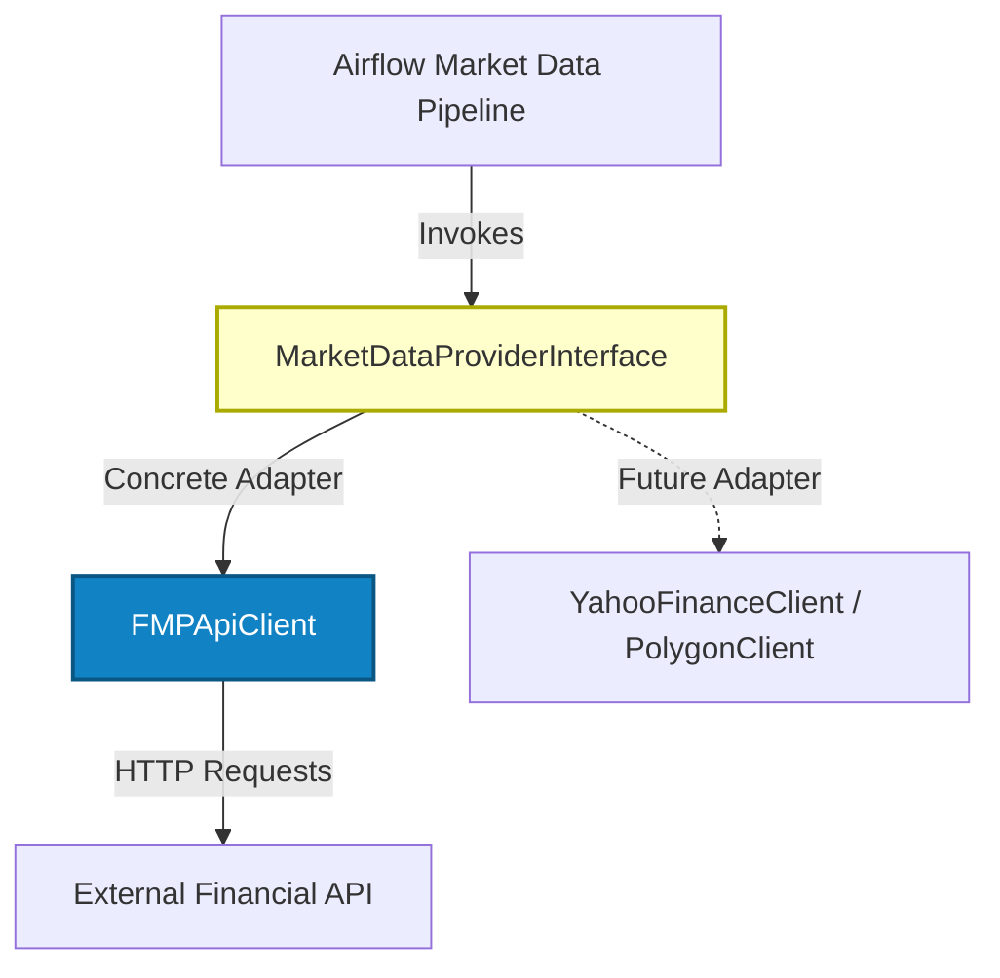
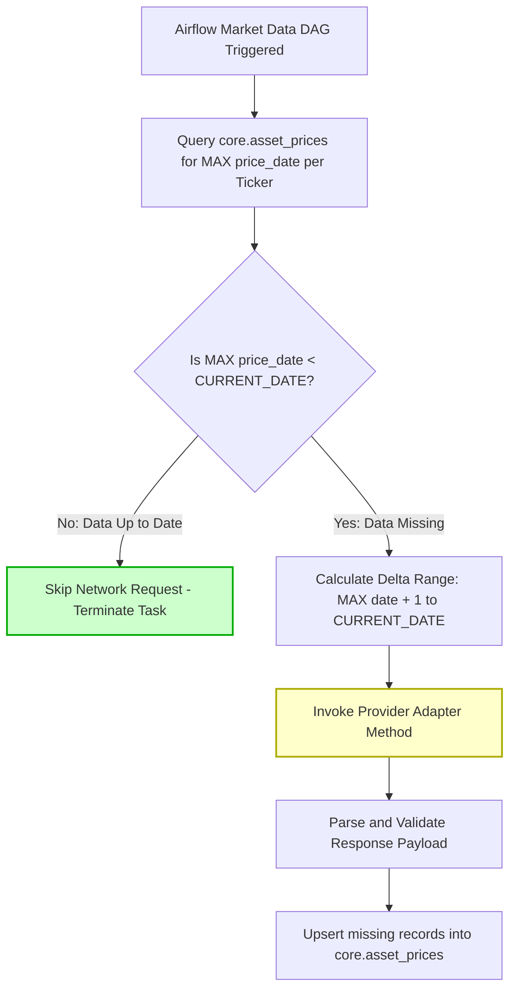

# API Integration and Quota Optimization Specification

This document details the external market data integration strategy, provider interface contracts, rate-limiting mechanics and incremental loading algorithms for the Multi-Asset Portfolio Analytics System.

---

## 1. Overview and Architectural Abstraction

The platform requires external financial market data to evaluate portfolio holdings. To prevent vendor lock-in and insulate the core system from third-party API changes, data retrieval is designed around an **Abstract Market Data Provider Interface**.



### API Quota Constraints (BR-05)
*   **Default Provider:** Financial Modeling Prep (FMP) API (Free Tier).
*   **Daily Request Limit:** 250 requests per calendar day.
*   **Engineering Requirement:** The ingestion pipeline must operate deterministically without exhausting the daily quota, regardless of pipeline execution frequency or manual backfills.

---

## 2. Market Data Provider Interface Contract

Any external market data client (e.g., FMP Adapter) must implement three standardized contract methods.

### 2.1. EOD Stock and ETF Price Retrieval (`fetch_eod_prices`)
Retrieves historical daily closing prices for active portfolio instruments over a specified date range.
*   **Input Contract:** `symbol` (string), `start_date` (Date), `end_date` (Date)
*   **Output Contract:** Array of normalized records containing:
    *   `date` (Date)
    *   `close_price` (Decimal)
    *   `currency` (ISO 3-letter currency code)
*   **Target Database Mapping:** Maps to `core.asset_prices` (`ticker`, `price_date`, `close_price`, `currency`).


---

### 2.2. Historical Forex Exchange Rate Retrieval (`fetch_fx_rates`)
Retrieves historical daily exchange rates to normalize multi-currency transactions into the portfolio base currency (**EUR**).
*   **Input Contract:** `base_currency` (string, e.g., 'EUR'), `quote_currency` (string, e.g., 'USD'), `start_date` (Date), `end_date` (Date)
*   **Output Contract:** Array of normalized records containing:
    *   `rate_date` (Date)
    *   `quote_currency` (String)
    *   `rate` (Decimal, exchange rate value)
*   **Target Database Mapping:** Maps to `core.fx_rates` (`base_currency`, `quote_currency`, `rate_date`, `rate`).


---

### 2.3. Stock Split Event Retrieval (`fetch_stock_splits`)
Retrieves corporate stock split history to adjust historical unit costs and position share counts.
*   **Input Contract:** `symbol` (string)
*   **Output Contract:** Array of records containing `split_date` (Date), `numerator` (Integer), `denominator` (Integer).


---

## 3. Quota Optimization: Incremental Sync Algorithm (Delta Load)

To prevent exceeding daily request limits, the Market Data DAG executes an **Incremental State-Checking Algorithm** prior to triggering network requests.



### Delta Load Rules:
1. **Active Ticker Scoping:** Queries `core.transaction_events` to retrieve only tickers currently held in active positions. Inactive or unreferenced tickers are ignored.
2. **State Inspection:** Queries the latest available date per active instrument:
   $$\text{MaxDate} = \max(\text{price\_date}) \quad \text{WHERE ticker} = X$$
3. **Range Targeting:** If $\text{MaxDate} < \text{CURRENT\_DATE}$, the adapter requests data only for the date window $[\text{MaxDate} + 1, \text{CURRENT\_DATE}]$. Historical dates already present in the DWH are never re-queried over the network.
4. **Idempotency:** Re-executing the pipeline on the same date results in 0 external network requests once state is synchronized.

---

## 4. Non-Trading Day Handling (Last Available Price - LAP)

Stock exchanges are closed on weekends and market holidays. On non-trading days, market data providers return no session payload.

To ensure continuous, gap-free portfolio valuation time-series in Apache Superset, the system applies the **Last Available Price (LAP) Forward-Fill Strategy**:

```
Date         Market Status    Provider Response  core.asset_prices Value  is_interpolated_lap
-----------------------------------------------------------------------------------------
2026-05-15   Friday (Open)    150.00 EUR        150.00 EUR              FALSE
2026-05-16   Saturday (Closed) No Session       150.00 EUR (Forward fill)TRUE
2026-05-17   Sunday (Closed)   No Session       150.00 EUR (Forward fill)TRUE
2026-05-18   Monday (Open)    152.50 EUR        152.50 EUR              FALSE
```

*   **Implementation:** After pulling session data for business days, an Airflow SQL transformation executes a forward-fill over a calendar date series. For missing session dates, it carries forward the last known price and sets `is_interpolated_lap = TRUE`.

---

## 5. Resilience and Local Testing Strategy

### 5.1. HTTP Error and Rate Limit Handling
*   **Rate Limit Exhaustion (HTTP 429):** The provider adapter catches 429 responses, logs a quota alert and defers remaining execution tasks to the next scheduled pipeline run without failing already-committed database transactions.
*   **Authentication and Access Errors (HTTP 403):** Raises an explicit system error to alert the System Administrator.

### 5.2. Local Development and Integration Testing (Mocking)
To protect production API quotas during local development and automated CI/CD testing:
*   **Mock Strategy:** Tests utilize Python `pytest` and HTTP mocking libraries (`requests_mock`) to intercept calls to external APIs.
*   **Fixture Isolation:** Local integration runs populate the DWH using mock JSON payloads stored in `dags/src/tests/fixtures/`.
