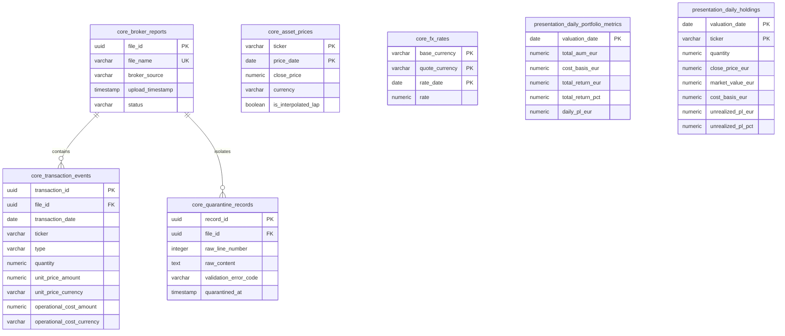

# Database Schema Specification: Multi-Asset Portfolio Analytics

This document defines the physical database schema for the PostgreSQL Data Warehouse (DWH). It outlines the tables, data types, constraints and relationships across the `staging`, `core` and `presentation` schemas.

---

## 1. Entity-Relationship Diagram (ERD)

The following diagram illustrates the logical model of the core ledger, market reference tables and presentation views.

---

## 2. Schema Architectures

### 2.1. Staging Schema (`staging`)
Used for initial data ingestion. Tables in this schema are transient or act as staging logs with no structural constraints or business logic applied.

#### Table: `staging.raw_broker_transactions`
Temporary storage for CSV records before parsing and normalization.
*   `raw_id` (BIGSERIAL, PRIMARY KEY)
*   `file_name` (VARCHAR)
*   `uploaded_at` (TIMESTAMP WITH TIME ZONE)
*   `raw_row_data` (JSONB) - Holds the raw column-value pairs from the broker's specific CSV file format.

---

### 2.2. Core Schema (`core`)
The system's single source of truth. Contains normalized transaction ledgers, reference market prices, FX rates and quarantined records.

#### Table: `core.broker_reports`
Tracks the history and status of uploaded files.
*   `file_id` (UUID, PRIMARY KEY, Default: `gen_random_uuid()`)
*   `file_name` (VARCHAR, UNIQUE, NOT NULL)
*   `broker_source` (VARCHAR, NOT NULL) - e.g., 'REVOLUT', 'INTERACTIVE_BROKERS', 'XTB'
*   `upload_timestamp` (TIMESTAMP WITH TIME ZONE, NOT NULL, Default: `CURRENT_TIMESTAMP`)
*   `status` (VARCHAR, NOT NULL) - 'PROCESSED', 'SUCCESS_WITH_WARNINGS', 'FAILED'

#### Table: `core.quarantine_records`
Holds rows that failed validation checks.
*   `record_id` (UUID, PRIMARY KEY, Default: `gen_random_uuid()`)
*   `file_id` (UUID, FOREIGN KEY references `core.broker_reports(file_id)`, ON DELETE CASCADE)
*   `raw_line_number` (INTEGER, NOT NULL)
*   `raw_content` (TEXT, NOT NULL) - Raw text of the corrupted row.
*   `validation_error_code` (VARCHAR, NOT NULL) - e.g., `ERR_NEG_QTY`, `ERR_INVALID_TICKER`
*   `quarantined_at` (TIMESTAMP WITH TIME ZONE, NOT NULL, Default: `CURRENT_TIMESTAMP`)

#### Table: `core.transaction_events`
The append-only ledger of verified trades and cash flows.
*   `transaction_id` (UUID, PRIMARY KEY, Default: `gen_random_uuid()`)
*   `file_id` (UUID, FOREIGN KEY references `core.broker_reports(file_id)`)
*   `transaction_date` (DATE, NOT NULL)
*   `ticker` (VARCHAR, NOT NULL) - e.g., 'AAPL', 'VWCE.DE'
*   `type` (VARCHAR, NOT NULL) - Constrained to: 'BUY', 'SELL', 'DIVIDEND'
*   `quantity` (NUMERIC(18, 8), NOT NULL) - High precision for fractional shares.
*   `unit_price_amount` (NUMERIC(18, 4), NOT NULL)
*   `unit_price_currency` (VARCHAR(3), NOT NULL)
*   `operational_cost_amount` (NUMERIC(18, 4), NOT NULL) - Sum of fees, taxes and broker commissions.
*   `operational_cost_currency` (VARCHAR(3), NOT NULL)

#### Table: `core.asset_prices`
EOD market closing prices.
*   `ticker` (VARCHAR, NOT NULL)
*   `price_date` (DATE, NOT NULL)
*   `close_price` (NUMERIC(18, 4), NOT NULL)
*   `currency` (VARCHAR(3), NOT NULL)
*   `is_interpolated_lap` (BOOLEAN, NOT NULL, Default: `FALSE`) - True if filled using Last Available Price (LAP).
*   *Constraints:* PRIMARY KEY (`ticker`, `price_date`)

#### Table: `core.fx_rates`
Foreign exchange rates relative to EUR.
*   `base_currency` (VARCHAR(3), NOT NULL, Default: 'EUR')
*   `quote_currency` (VARCHAR(3), NOT NULL) - e.g., 'USD', 'GBP'
*   `rate_date` (DATE, NOT NULL)
*   `rate` (NUMERIC(18, 6), NOT NULL) - Rate to convert quote currency to EUR (EUR = foreign_amount * rate).
*   *Constraints:* PRIMARY KEY (`quote_currency`, `rate_date`)

---

### 2.3. Presentation Schema (`presentation`)
Analytical datasets optimized for quick queries by BI tools (Apache Superset).

#### Table: `presentation.daily_portfolio_metrics`
Aggregated daily portfolio indicators.
*   `valuation_date` (DATE, PRIMARY KEY)
*   `total_aum_eur` (NUMERIC(18, 2), NOT NULL) - Current assets under management.
*   `cost_basis_eur` (NUMERIC(18, 2), NOT NULL) - Total capital invested (adjusted for splits and sales).
*   `total_return_eur` (NUMERIC(18, 2), NOT NULL) - Net gain (`total_aum_eur` - `cost_basis_eur`).
*   `total_return_pct` (NUMERIC(8, 4), NOT NULL) - Percentage gain/loss.
*   `daily_pl_eur` (NUMERIC(18, 2), NOT NULL) - Valuation change compared to the previous day.

#### Table: `presentation.daily_holdings`
Individual asset positions and metrics for each day.
*   `valuation_date` (DATE, NOT NULL)
*   `ticker` (VARCHAR, NOT NULL)
*   `quantity` (NUMERIC(18, 8), NOT NULL)
*   `close_price_eur` (NUMERIC(18, 4), NOT NULL)
*   `market_value_eur` (NUMERIC(18, 2), NOT NULL) - `quantity` * `close_price_eur`
*   `cost_basis_eur` (NUMERIC(18, 2), NOT NULL) - Average purchase cost * quantity
*   `unrealized_pl_eur` (NUMERIC(18, 2), NOT NULL) - Net gain/loss on position
*   `unrealized_pl_pct` (NUMERIC(8, 4), NOT NULL)
*   *Constraints:* PRIMARY KEY (`valuation_date`, `ticker`)
