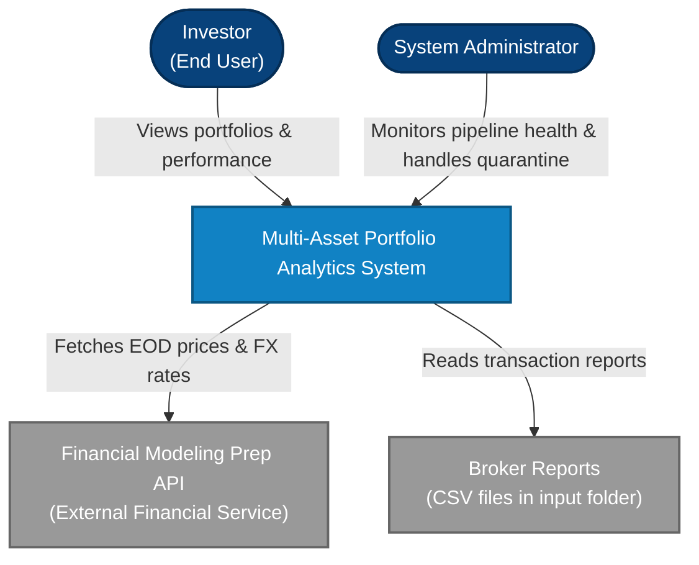
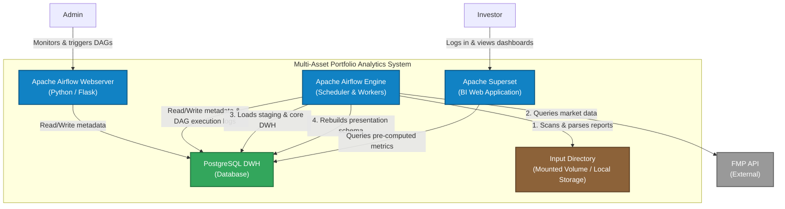

# System Architecture Specification (C4 Model): Multi-Asset Portfolio Analytics

This document defines the system architecture using the C4 Model methodology (Level 1: System Context and Level 2: Container Diagram).

---

## 1. Level 1: System Context Diagram

The System Context diagram provides a high-level overview of how the Multi-Asset Portfolio Analytics System interacts with user and external services.

### Actors & External Systems Description
*   **Investor:** The primary user of the system. Looks at aggregated financial KPIs, holdings allocation and AUM performance charts.
*   **System Administrator:** The operator responsible for configuration, managing API keys, reviewing logs and handling quarantined records that failed quality checks.
*   **Financial Modeling Prep (FMP) API:** External source of truth for financial market data. Sells or provides free daily stock/ETF closing prices, split actions and FX exchange rates.
*   **Broker Reports:** Raw transaction files exported from various brokers (e.g., Interactive Brokers, Revolut, XTB) placed into a designated input folder.

---

## 2. Level 2: Container Diagram

The Container diagram zooms into the system boundary, showing the technical building blocks (containers and how they communicate.

### Containers Description

1.  **Apache Superset (BI App):**
    *   *Technology:* Python / Flask / React / Docker container.
    *   *Responsibility:* Renders the interactive portfolio dashboards. Connects only to the `presentation` schema of the database to run high-performance analytical queries.
2.  **Apache Airflow Webserver:**
    *   *Technology:* Python / Flask / Docker container.
    *   *Responsibility:* Administrative UI. Allows the admin to view pipeline execution states, task durations and trigger manual restarts.
3.  **Apache Airflow Engine (Scheduler & Workers):**
    *   *Technology:* Python / Celery / Docker container.
    *   *Responsibility:* Orchestrate and executes the ETL tasks (reading CSV files from the input folder, calling FMP API, validating schema constraints, filtering quarantine rows and calculating daily portfolio valuations).
4.  **PostgreSQL DWH (Database):**
    *   *Technology:* PostgreSQL 15+ / Docker container.
    *   *Responsibility:* Heart of the data layer. Divided into three logical schemas:
        *   `staging`: Transient dat and raw uploads.
        *   `core`: Normalized ledger (`transaction_events`), `quarantine_records`, `asset_prices` and `fx_rates`.
        *   `presentation`: Pre-calculated views optimized for dashboard reporting (`daily_holdings`, `daily_portfolio_metrics`).
5.  **Input Directory:**
    *   *Technology:* Docker shared volume / local filesystem folder.
    *   *Responsibility:* Directory where CSV files are placed by the user or an automated script, acting as the landing zone for the Fetch Context.
