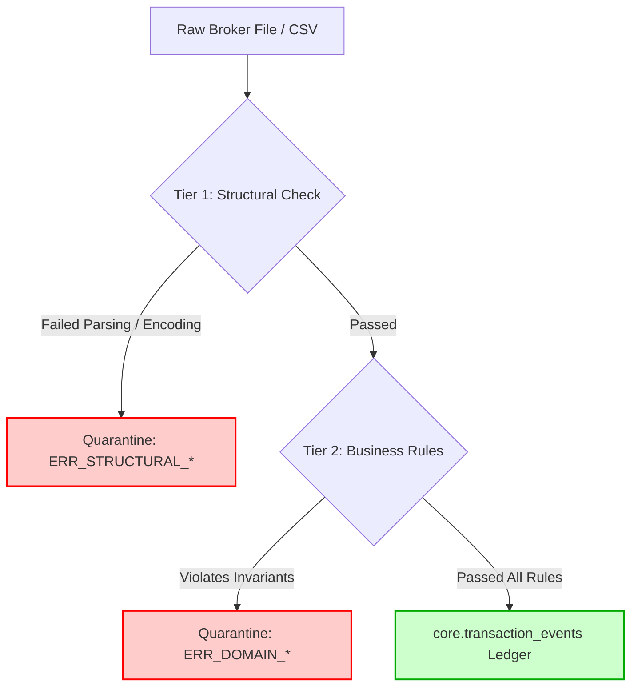

# Data Quality and Quarantine Framework Specification

This document defines the Data Quality (DQ) validation rules, error taxonomy and quarantine isolation mechanics for the Multi-Asset Portfolio Analytics System.

---

## 1. Data Quality Philosophy

In production data engineering, input files from brokers or external platforms frequently suffer from formatting anomalies, missing values, or corrupted lines. Aborting an entire batch pipeline due to a single bad row causes data staleness and operational fatigue.

This platform enforces a **Fault-Tolerant Ingestion Pattern** governed by two core principles:
1. **Target-Driven Validation:** Data quality is evaluated against strict domain invariants required by the `TransactionEvent` target model, regardless of the source broker file format.
2. **Fault Isolation ("Success with Warnings"):** Corrupted or non-compliant rows are extracted, tagged with a standardized error code and written to `core.quarantine_records`. Valid rows in the same file are processed successfully into `core.transaction_events`. The pipeline run terminates with a `SUCCESS_WITH_WARNINGS` status without crashing or rolling back clean data.

---

## 2. Two-Tier Validation Architecture

The system evaluates incoming data across two distinct validation tiers:



### 2.1. Tier 1: Structural and Syntactic Validation (Fetch Stage)
Verifies that the raw input file and individual lines can be parsed correctly into memory.
*   **File Integrity:** Checks if the file is readable, non-empty and  uses valid UTF-8 encoding.
*   **Delimiter and Column Splitting:** Verifies that a row contains the expected number of delimited fields.
*   **Type Casting:** Ensures basic values can be cast to primitive data types (e.g., strings to dates or decimals) without throwing runtime exceptions.

### 2.2. Tier 2: Business and Domain Validation (Core Ledger Stage)
Evaluates logical constraints and financial invariants required by the `Accounting and Valuation Context`.
*   **Non-Null Constraints:** Mandates that mandatory domain fields (`transaction_date`, `ticker`, `type`, `quantity`, `unit_price_amount`) are populated.
*   **Numeric Range Bounds:** Guarantees that purchase/sale quantities and unit prices are strictly positive values ($> 0$).
*   **Taxonomy and Enum Integrity:** Validates that `type` matches authorized transaction categories (`BUY`, `SELL`, `DIVIDEND`) and `currency` conforms to ISO 4217 standard 3-letter codes.
*   **Temporal Sanity:** Ensures `transaction_date` is not set in the future ($date \le CURRENT\_DATE$).

---

## 3. Error Taxonomy and Standardized Error Codes

When a record fails Tier 1 or Tier 2 validation, the quarantine engine tags the row with a standardized error code.

| Error Code | Validation Tier | Trigger Condition | Business Justification |
| :--- | :--- | :--- | :--- |
| `ERR_STRUCTURAL_PARSING_FAILED` | Tier 1 (Structural) | Poorly formed  CSV row, delimiter mismatch, or unparseable text. | Prevents pipeline crashes during string-to-number casting. |
| `ERR_MISSING_REQUIRED_FIELD` | Tier 2 (Domain) | A required field (`date`, `ticker`, `quantity`, `price`) is NULL or blank. | Incomplete rows corrupt ledger aggregation and position sizes. |
| `ERR_INVALID_TRANSACTION_TYPE` | Tier 2 (Domain) | Transaction type is not in `['BUY', 'SELL', 'DIVIDEND']`. | Unrecognized transaction types corrupt portfolio movement formulas. |
| `ERR_NON_POSITIVE_QUANTITY` | Tier 2 (Domain) | `quantity` $\le 0$ for a BUY or SELL event. | Negative or zero share quantities violate ledger math. |
| `ERR_NON_POSITIVE_PRICE` | Tier 2 (Domain) | `unit_price_amount` $\le 0$. | Free or negative asset prices distort Cost Basis calculation. |
| `ERR_UNSUPPORTED_CURRENCY` | Tier 2 (Domain) | Currency code is not a valid 3-letter ISO code (e.g., blank or 'USDOLLARS'). | Prevents FX conversion failures during EUR base currency conversion. |
| `ERR_FUTURE_TRANSACTION_DATE` | Tier 2 (Domain) | `transaction_date` > current pipeline execution date. | Historical portfolio valuation cannot incorporate future trades. |

---

## 4. Quarantine Engine and Storage Schema

Quarantined records are isolated directly into `core.quarantine_records` for auditing and inspection by the System Administrator.

### Physical Quarantine Table Structure
```sql
CREATE TABLE core.quarantine_records (
    record_id             UUID PRIMARY KEY DEFAULT gen_random_uuid(),
    file_id               UUID NOT NULL REFERENCES core.broker_reports(file_id) ON DELETE CASCADE,
    raw_line_number       INTEGER NOT NULL,
    raw_content           TEXT NOT NULL,
    validation_error_code VARCHAR(50) NOT NULL,
    quarantined_at        TIMESTAMP WITH TIME ZONE NOT NULL DEFAULT CURRENT_TIMESTAMP
);
```

### Quarantine Data Lifecycle
1. **Detection:** Airflow Python operator executes Tier 1 and Tier 2 validator functions on each ingested record.
2. **Isolation:** If validation returns an error, the row's original text (`raw_content`), line index (`raw_line_number`) and  associated `validation_error_code` are written to `core.quarantine_records`.
3. **Execution Policy:** The batch task logs a warning metric and allows valid rows from the same `BrokerReport` to be inserted into `core.transaction_events`.
4. **Monitoring:** The System Administrator inspects quarantined records via Airflow logs or custom SQL queries to resolve raw file formatting issues.

---

## 5. Generic Source-to-Target Mapping Blueprint

To illustrate how raw source files (whether from Kaggle, Revolut, XTB, or Interactive Brokers) interface with the Data Quality Framework, the ingestion parser executes a standardized mapping flow:

```
[Raw Broker CSV Row]
       │
       ├──> Raw Field "Date / Timestamp" ──> Validate Date ──> core.transaction_events.transaction_date
       ├──> Raw Field "Symbol / Ticker"  ──> Validate String──> core.transaction_events.ticker
       ├──> Raw Field "Action / Type"    ──> Validate Enum  ──> core.transaction_events.type
       ├──> Raw Field "Shares / Volume"  ──> Validate > 0   ──> core.transaction_events.quantity
       └──> Raw Field "Price / Amount"   ──> Validate > 0   ──> core.transaction_events.unit_price_amount
```

Any discrepancy during column mapping or type transformation automatically routes the raw row to `core.quarantine_records` without affecting existing target ledger entries.
