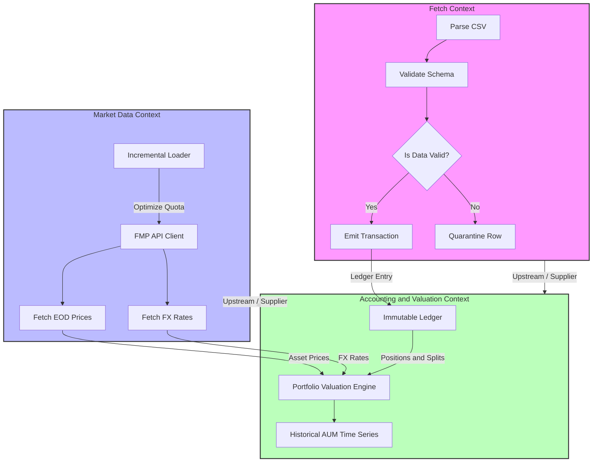

# Domain-Driven Design (DDD) Specification: Multi-Asset Portfolio Analytics

This document defines the domain structure of the system using Domain-Driven Design (DDD) principles. This specification bridges clean business architecture with technical implementation in the Data Warehouse (DWH) and ETL pipelines.


## 1. Strategic design

To maintain conceptual integrity and avoid mixing technical logic (e.g., parsing files) with financial logic (e.g., portfolio valuation), the system is divided into three **Bounded Contexts**.



### 1.1. Fetch Context
Responsible for handling the system input. The responsibility is to fetch physical files provided by brokers, validate their technical structural integrity, map columns to a unified format and either pass them forward or reject them to the quarantine zone.
*   **Boundaries:** From the moment a CSV file is detected in the input directory to the point of insertion into the database.
*   **Business Impact:** Fault isolation (FR-07) – errors in raw input files must not affect database stability or calculations in other contexts.

### 1.2. Market Data Context
Responsible for integration with external financial data providers (FMP API) and delivering reference market prices and historical exchange rates.
*   **Boundaries:** FMP API interactions, the incremental state checking mechanism (FR-05) and the implementation of the LAP (Last Available Price - FR-04) strategy.
*   **Business Impact:** API quota protection (BR-05) – optimization and caching of network requests protect the free API tier from exhaustion.

### 1.3. Accounting and Valuation Context
The core of the system. Responsible for maintaining the Immutable Ledger, calculating historical cost bases (Cost Basis), handling corporate actions (splits), and generating daily portfolio valuations (Assets Under Management - AUM) in the base currency (EUR).
*   **Boundaries:** Internal database tables and transformation procedures in the `core` and `presentation` schemas.
*   **Business Impact:** Analytical precision (BR-04, BR-02, BR-03) – calculating net returns without currency distortions.

---

## 2. Context Map

Context relationships are built on the **Customer-Supplier** pattern:

1.  **Fetch Context (Supplier) -> Accounting and Valuation Context (Customer)**
    *   *Description:* The Fetch Context delivers clean, validated transactions. If the Fetch output schema changes, the Accounting Context is impacted. Changes in Accounting requirements force adjustments in Fetch.
2.  **Market Data Context (Supplier) -> Accounting and Valuation Context (Customer)**
    *   *Description:* The Market Data Context delivers the necessary prices and exchange rates for portfolio valuation calculations.

---

## 3. Tactical Design

### 3.1. Fetch Context

```
+------------------------------------------+
| Entity: BrokerReport                     |
|   - file_id (UUID)                       |
|   - file_name (String)                   |
|   - broker_source (BrokerType)           |
|   - upload_timestamp (DateTime)          |
+------------------------------------------+
                     | 1
                     |
                     | N
+------------------------------------------+
| Value Object: QuarantineRecord           |
|   - raw_line_number (Integer)            |
|   - raw_content (String)                 |
|   - validation_error_code (String)       |
|   - quarantined_at (DateTime)            |
+------------------------------------------+
```

*   **BrokerReport (Entity):** Represents a specific file uploaded by the user. It has a unique identifier, name, source broker info, and processing status.
*   **QuarantineRecord (Value Object):** Represents a single row from the input file that failed technical or business validation. It is immutable and contains the exact error details and a dump of the original raw line.

### 3.2. Market Data Context

```
+------------------------------------------+
| Value Object: Ticker                     |
|   - symbol (String) e.g. "AAPL"          |
|   - exchange (String) e.g. "NASDAQ"      |
+------------------------------------------+
                     |
                     |
+------------------------------------------+
| Entity: AssetPrice                       |
|   - ticker (Ticker)                      |
|   - price_date (Date)                    |
|   - close_price (Decimal)                |
|   - currency (CurrencyCode)              |
|   - is_interpolated_lap (Boolean)        |
+------------------------------------------+

+------------------------------------------+
| Value Object: FxRate                     |
|   - base_currency (CurrencyCode) = EUR   |
|   - quote_currency (CurrencyCode)        |
|   - rate_date (Date)                     |
|   - rate (Decimal)                       |
+------------------------------------------+
```

*   **Ticker (Value Object):** Unique identifier of a financial instrument (e.g., `AAPL`, `VWCE.DE`).
*   **AssetPrice (Entity):** The End-of-Day (EOD) closing price of an instrument. Identified by the `(ticker, price_date)` pair. Contains an `is_interpolated_lap` flag indicating whether the price comes from a trading session or was filled for a non-trading day (weekend/holiday) via the LAP algorithm.
*   **FxRate (Value Object):** Exchange rate of a foreign currency to EUR on a specific date (e.g., `USD/EUR = 0.9205`).

### 3.3. Accounting and Valuation Context

```
+-------------------------------------------------------------+
| Aggregate Root: PortfolioLedger                             |
|   - portfolio_id (UUID)                                     |
|   - base_currency (CurrencyCode) = EUR                      |
|   + calculate_aum(valuation_date) -> Money                  |
|   + calculate_position(ticker) -> Position                  |
+-------------------------------------------------------------+
                              | 1
                              |
                              | N
+-------------------------------------------------------------+
| Entity: TransactionEvent (Immutable)                        |
|   - transaction_id (UUID)                                   |
|   - transaction_date (Date)                                 |
|   - ticker (Ticker)                                         |
|   - type (TransactionType) [BUY, SELL, DIVIDEND]            |
|   - quantity (Decimal)                                      |
|   - unit_price (Money)                                      |
|   - operational_cost (Money) e.g. commission / tax          |
+-------------------------------------------------------------+
```

*   **PortfolioLedger (Aggregate Root):** The main entry point for the investor's transactional data. Guarantees that holdings (Positions) and valuation (AUM) are always computed from a consistent set of transactions.
*   **TransactionEvent (Entity):** A single, immutable entry in the general ledger. It cannot be modified or deleted. Any adjustments or error corrections require writing a correcting transaction (e.g., a refund).
*   **Money (Value Object):** A structure representing monetary value (high-precision amount, e.g., 4 decimal places and currency code). Prevents rounding errors and mixed-currency operations without conversion.
*   **Position (Value Object):** The current number of units held for a specific instrument along with its calculated historical cost basis. Computed dynamically.

---

## 4. Domain Events

To achieve loose asynchronous data pipelines, the contexts communicate via domain events:

1.  **`BrokerReportUploaded`**
    *   *Publisher:* Inbound system.
    *   *Consumer:* Fetch Context.
    *   *Effect:* Triggers the parser for the specific broker format.
2.  **`TransactionEventParsed`**
    *   *Publisher:* Fetch Context.
    *   *Consumer:* Accounting and Valuation Context.
    *   *Effect:* Writes a valid transaction record to the transaction ledger.
3.  **`QuarantineRecordCreated`**
    *   *Publisher:* Fetch Context.
    *   *Consumer:* Notification System / Admin Monitor.
    *   *Effect:* Writes the corrupted row to the quarantine table along with the error reason code.
4.  **`MarketPriceFetched` / `FxRateFetched`**
    *   *Publisher:* Market Data Context.
    *   *Consumer:* Accounting and Valuation Context.
    *   *Effect:* Updates the reference pricing tables and triggers LAP interpolation for weekends/holidays.
5.  **`StockSplitDetected`**
    *   *Publisher:* Market Data Context.
    *   *Consumer:* Accounting and Valuation Context.
    *   *Effect:* Triggers recalculation of historical positions and unit cost bases for the specified ticker.
6.  **`PortfolioDailyValued`**
    *   *Publisher:* Accounting and Valuation Context.
    *   *Consumer:* BI Layer (Apache Superset Cache Refresher).
    *   *Effect:* Rebuilds the presentation views for the specified date and refreshes the BI dashboard cache.
